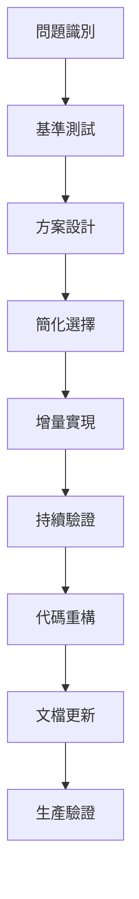

# 重構工作目錄

## 目錄說明

本目錄包含 Fat Identity Cat 專案的重構工作指南和最佳實踐。

## 文檔結構

### 📚 現有文檔

- **[REFACTOR_BEST_PRACTICES.md](./REFACTOR_BEST_PRACTICES.md)** - 重構最佳實踐指南
  - 基於 Consumer v2.0 重構的成功經驗
  - 技術實施策略和常見陷阱避免
  - 實用的重構方法論

## 使用指南

### 開始新的重構項目時

1. **📋 閱讀最佳實踐指南**
   ```bash
   # 閱讀重構經驗總結
   docs/claude/refactor/REFACTOR_BEST_PRACTICES.md
   ```

2. **📚 參考成功案例**
   ```bash
   # 查看完整的重構歷史
   docs/claude/archieve/2025-09/consumer-refactor/
   ```

3. **🎯 應用經驗教訓**
   - 實用主義優先，避免過度設計
   - 漸進式改進，保持向後兼容
   - 性能測試驅動，用數據驗證效果

## 重構流程建議



## 成功標準

基於 Consumer v2.0 重構經驗，成功的重構應該達到：

- ✅ **功能完整**: 所有原有功能保持正常
- ✅ **性能提升**: 有測試數據支撐的性能改進
- ✅ **代碼品質**: 測試覆蓋率 >85%，複雜度控制
- ✅ **向後兼容**: 不破壞現有 API 和使用方式
- ✅ **文檔完善**: 完整的技術文檔和使用指南

## 歷史記錄

- **2025-09-12**: Consumer v2.0 重構完成，性能提升 3.3 倍
- **2025-09-09**: Consumer v3.0 複雜設計，後被簡化為 v2.0
- **2025-09-09**: Router v2.0 統一管理系統完成

---

**目錄維護**: Claude Code Agent  
**最後更新**: 2025-09-12